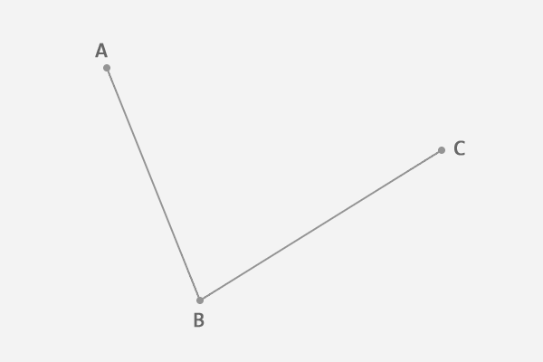
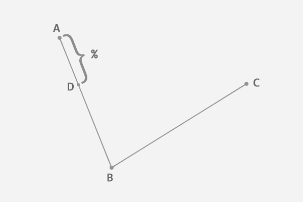
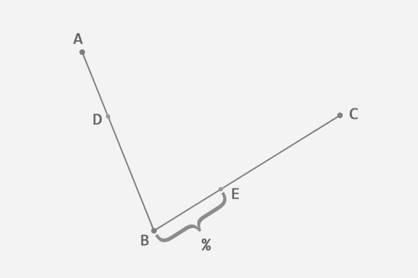
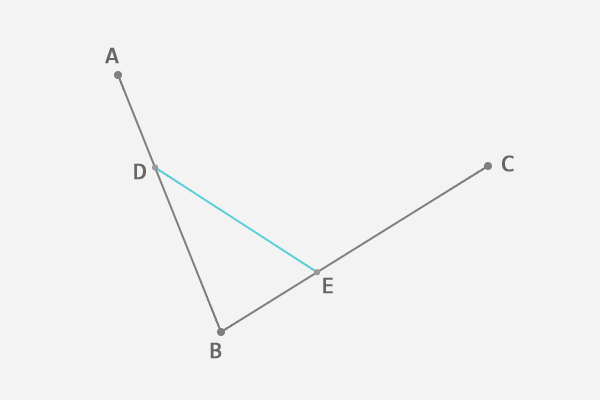
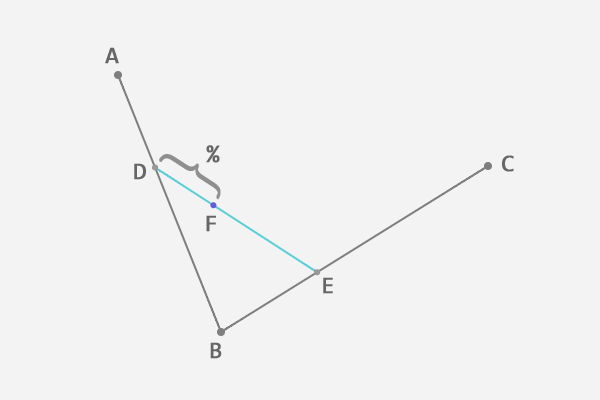
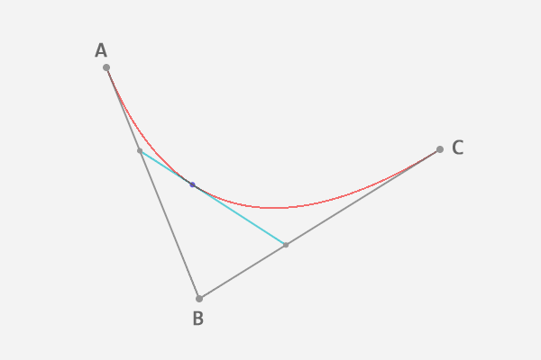
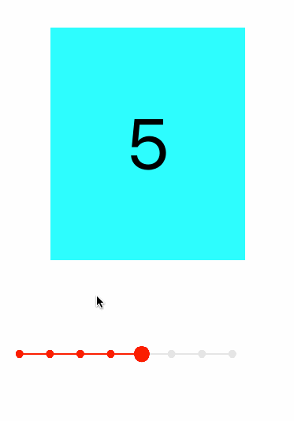
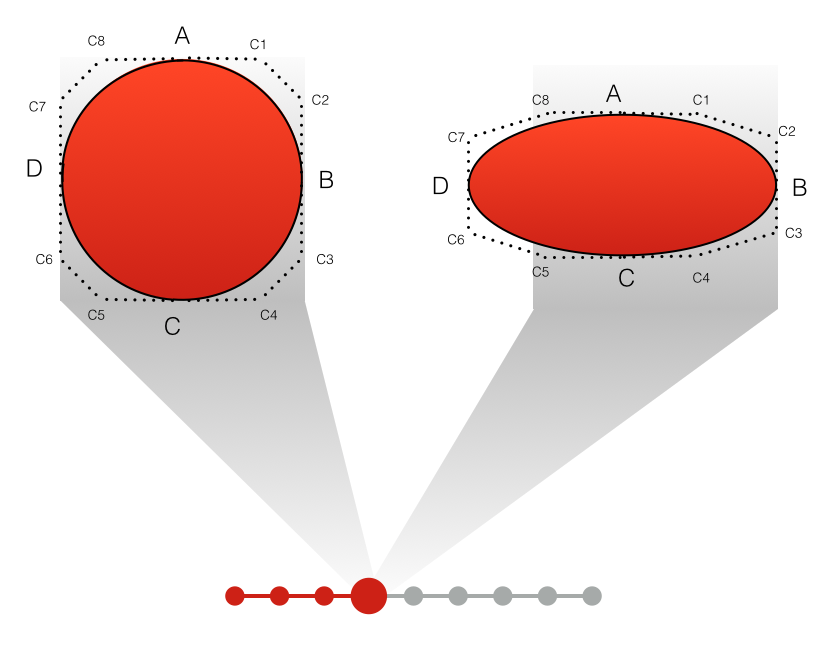

#贝塞尔曲线
##理论
贝塞尔曲线的数学基础是早在 1912 年就广为人知的伯恩斯坦多项式。但直到 1959 年，当时就职于雪铁龙的法国数学家 Paul de Casteljau 才开始对它进行图形化应用的尝试，并提出了一种数值稳定的 de Casteljau 算法。然而贝塞尔曲线的得名，却是由于 1962 年另一位就职于雷诺的法国工程师 Pierre Bézier 的广泛宣传。他使用这种只需要很少的控制点就能够生成复杂平滑曲线的方法，来辅助汽车车体的工业设计。

正是因为控制简便却具有极强的描述能力，贝塞尔曲线在工业设计领域迅速得到了广泛的应用。不仅如此，在计算机图形学领域，尤其是矢量图形学，贝塞尔曲线也占有重要的地位。今天我们最常见的一些矢量绘图软件，如 Flash、Illustrator、CorelDraw 等，无一例外都提供了绘制贝塞尔曲线的功能。甚至像 Photoshop 这样的位图编辑软件，也把贝塞尔曲线作为仅有的矢量绘制工具（钢笔工具）包含其中。

下面我们就通过例子来了解一下如何用 de Casteljau 算法绘制一条贝塞尔曲线。

在平面内任选 3 个不共线的点，依次用线段连接。

在第一条线段上任选一个点 D。计算该点到线段起点的距离 AD，与该线段总长 AB 的比例。

根据上一步得到的比例，从第二条线段上找出对应的点 E，使得 AD:AB = BE:BC。

连接这两点 DE。

从新的线段 DE 上再次找出相同比例的点 F，使得 DF:DE = AD:AB = BE:BC。

到这里，我们就确定了贝塞尔曲线上的一个点 F。接下来，请稍微回想一下中学所学的极限知识，让选取的点 D 在第一条线段上从起点 A 移动到终点 B，找出所有的贝塞尔曲线上的点 F。所有的点找出来之后，我们也得到了这条贝塞尔曲线。

如果你实在想象不出这个过程，没关系，看动画！
回过头来看这条贝塞尔曲线，为了确定曲线上的一个点，需要进行两轮取点的操作，因此我们称得到的贝塞尔曲线为二次曲线（这样记忆很直观，但曲线的次数其实是由前面提到的伯恩斯坦多项式决定的）。

##AnimatedPageControl

核心就是贝塞尔曲线变换逻辑，如图。代码[在此](animatedPageControl)。

##GooeySlideMenu

###Quartz2D
Quartz 2D是一个二维绘图引擎，同时支持iOS和Mac系统

Quartz2D提供了以下几种类型的Graphics Context：

* Bitmap Graphics Context 位图上下文，在这个上下文上绘制或者渲染的内容，可以获取成图片（需要主动创建一个位图上下文来使用，使用完毕，一定要销毁）
* PDF Graphics Context
* Window Graphics Context
* Layer Graphics Context 图层上下文，针对UI控件的上下文
* Printer Graphics Context

##解析

把一个复杂的动画分解为几个动画，然后再把这些分动画逐一解决。要会抽象出这动画的过程。此动画用辅助视图完成代码[在此](JKGooeySlideMenuDemo)。

